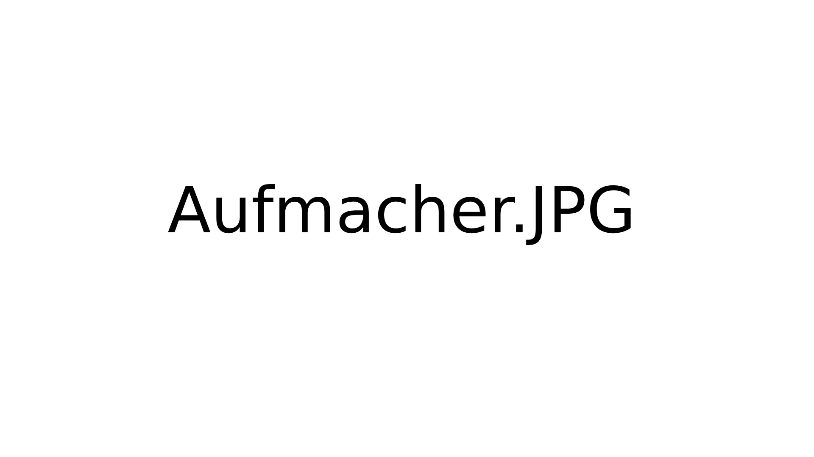

Maker Media GmbH

***

# Projektname

## Erklärende Unterzeile (optional)

**Vorspann aus dem Heft**

## Wer den Aufmacher skalieren muss:

Hier gibt es !!! ein Template für die README.md in Github. Das Aufmacherbild sowie weitere Doku soll in den Ordner _doc_. Bitte für andere Dateien sinnvolle Ordner anlegen, etwa _src_ oder _cad_.
ISSUES UND WIKI DEAKTIVIEREN NICHT VERGESSEN.

Der vollständige Artikel zum Projekt steht in der **[Make-Ausgabe x/yy ab Seite z](https://www.heise.de/select/make/xxx)**.
